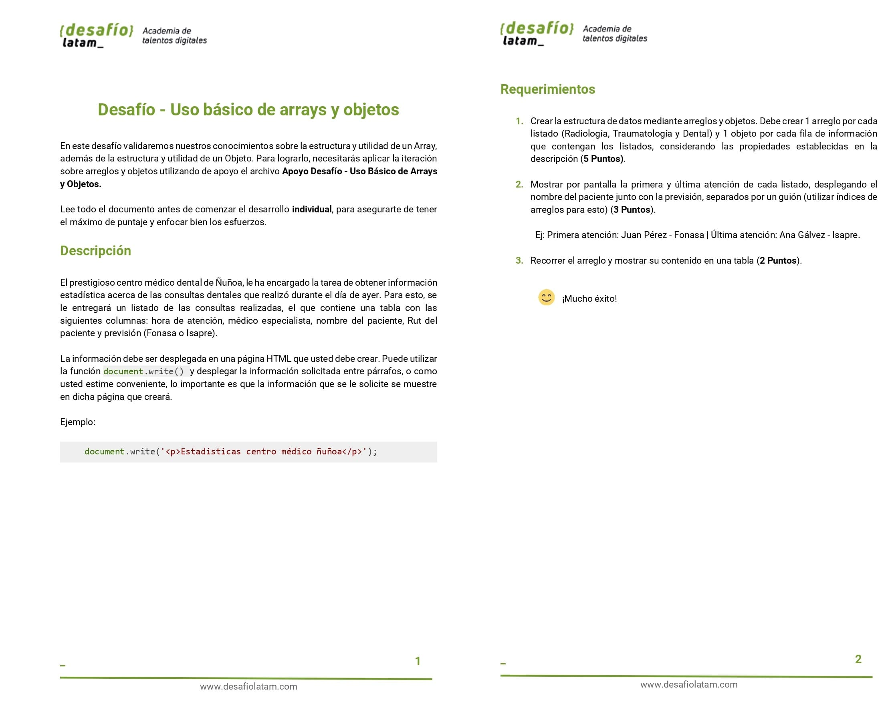
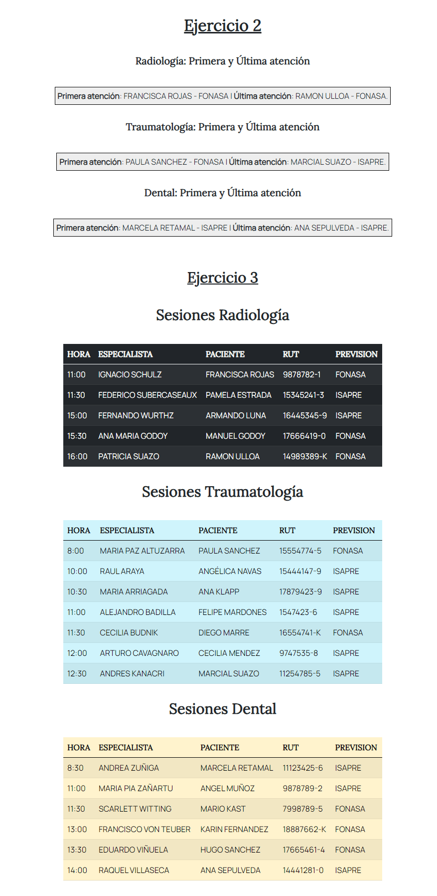
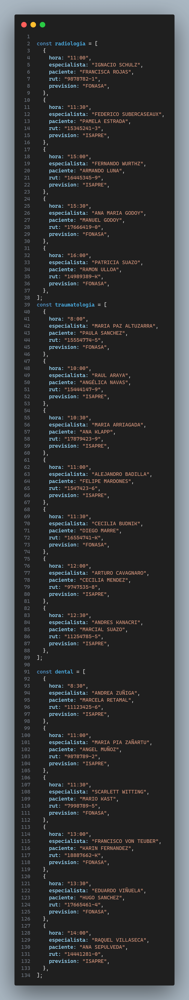
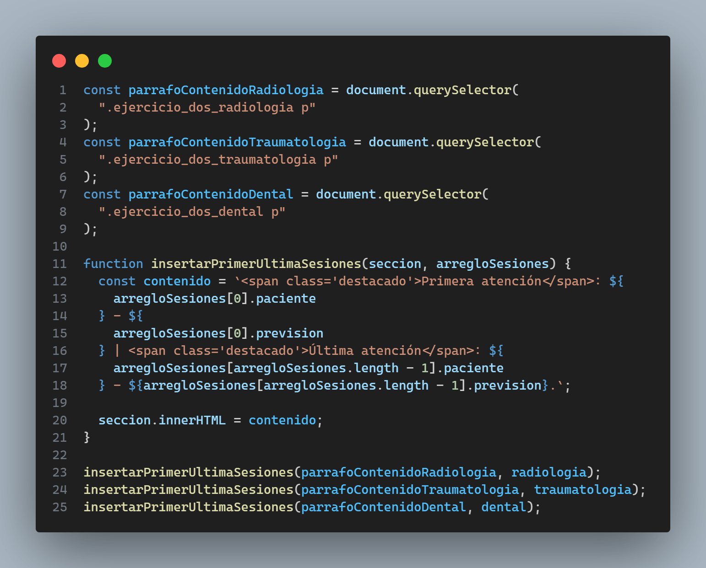
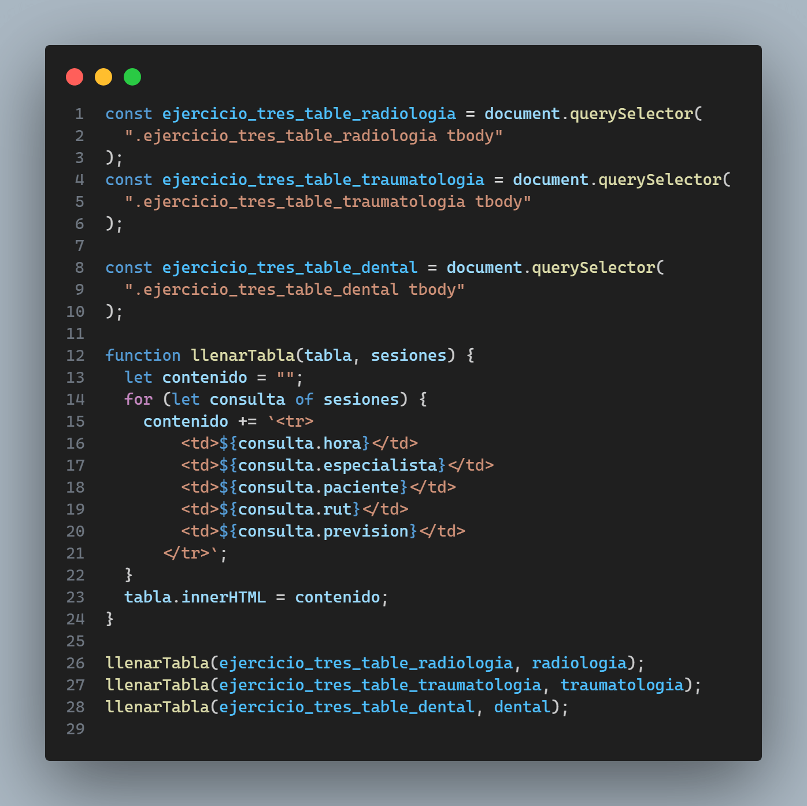

Este repositorio contiene el código del desafío obligatorio llamado **Uso básico de arrays y objetos** del módulo tres Fundamentos de programación en JavaScript. He utilizado:

Los requsitos del proyecto son los siguientes:

El screenshot del proyecto live con los ejercicios 2 y 3 los cuales requieren mostrar data en pantalla es el siguiente:

### 1. Ejercicio 1

### 2. Ejercicio 2

### 3. Ejercicio 3

